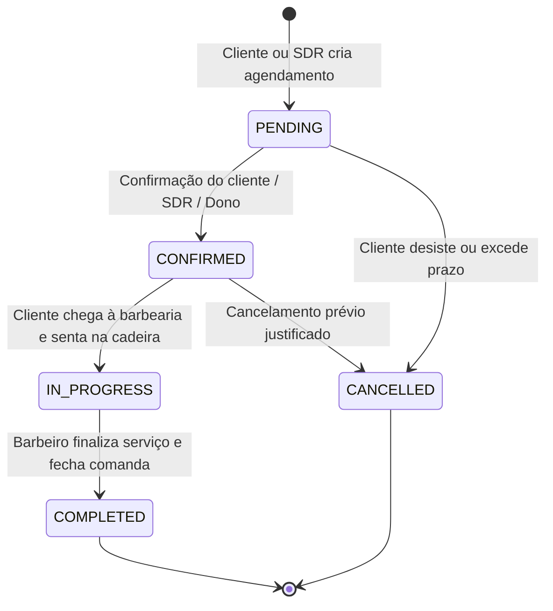
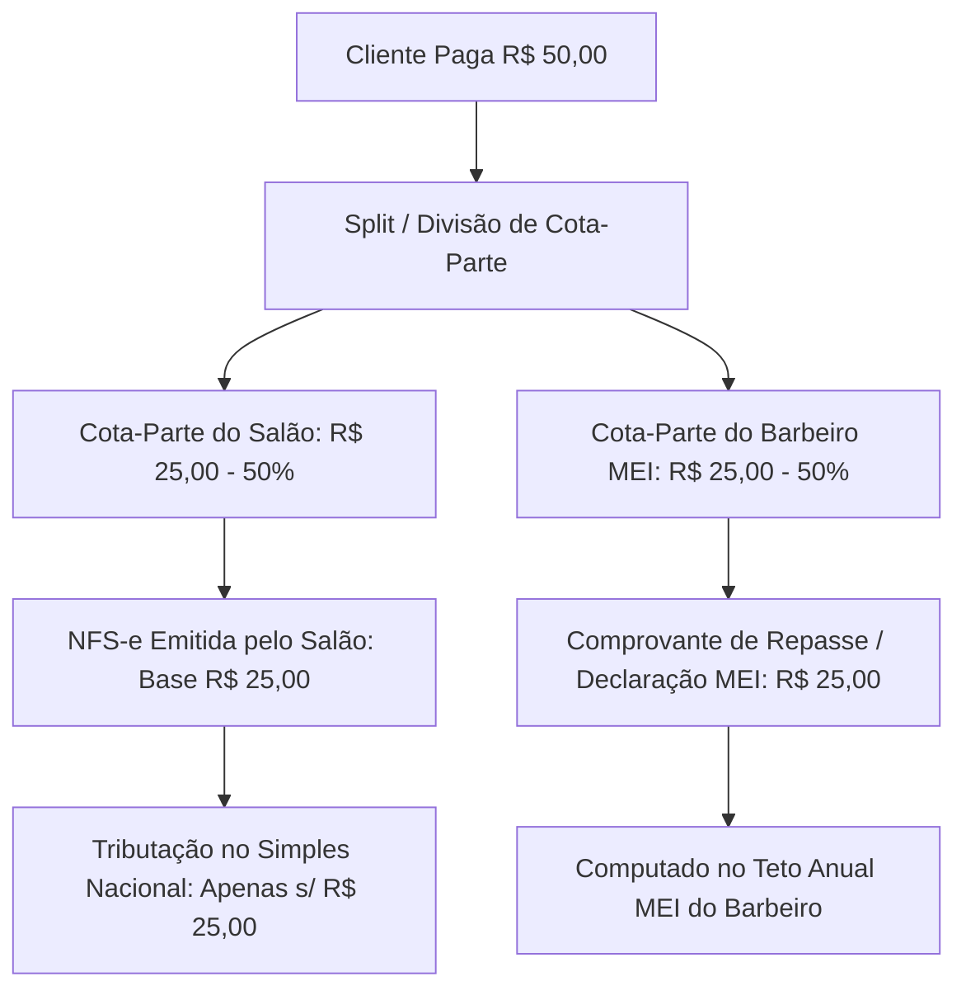
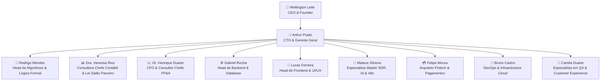

# 📘 88Barber — Manual Oficial de Regras de Negócio & Governança (BUSINESS_RULES.md)

---

## 🎯 Sumário Executivo & Visão do Produto

O **88Barber** é uma plataforma *All-in-One* de SaaS e Fintech projetada especificamente para o mercado de barbearias e centros estéticos masculinos de alta performance. 

O software transcende os sistemas tradicionais de agendamento ao unificar em uma única suíte tecnológica:
1. **Front-Office Inteligente**: SDR Autônomo com Inteligência Artificial via WhatsApp (Whisper Groq + LLaMA) com agendamento conversacional em tempo real e WebApp White-Label responsivo.
2. **Back-Office Operacional**: Gestão multi-unidade, controle de equipe, comissões dinâmicas, controle de comandas digitais (PDV), gestão de estoque com inventário e programa de fidelidade/assinaturas recorrentes de clientes finais.
3. **Governança Contábil-Tributária Blindada**: Adequação integral à **Lei do Salão Parceiro (Lei Federal nº 13.352/2016)**, com segregação matemática e jurídica da cota-parte do salão versus cota-parte do profissional parceiro (MEI), eliminando riscos de bitributação no Simples Nacional e prevenindo passivos trabalhistas.
4. **Inteligência Financeira & FP&A**: DRE Gerencial automático, Fluxo de Caixa Projetado, cálculo de Ponto de Equilíbrio (*Break-Even*) por Cadeira/Profissional e relatórios analíticos de rentabilidade real.

---

## 📑 Índice Geral

1. [Multi-Tenancy & Arquitetura SaaS](#1-multi-tenancy--arquitetura-saas)
2. [Gestão de Agendamentos & Algoritmo da Agenda](#2-gestão-de-agendamentos--algoritmo-da-agenda)
3. [SDR Autônomo & Atendimento Inteligente WhatsApp](#3-sdr-autônomo--atendimento-inteligente-whatsapp)
4. [Lei Salão Parceiro & Governança Contábil/Tributária](#4-lei-salão-parceiro--governança-contábiltributária)
5. [Inteligência Financeira, FP&A & Métricas SaaS](#5-inteligência-financeira-fpa--métricas-saas)
6. [Governança Corporativa & Roster Oficial da Equipe](#6-governança-corporativa--roster-oficial-da-equipe)

---

## 1. Multi-Tenancy & Arquitetura SaaS

### 1.1. Modelo de Isolamento de Dados (Tenant Isolation)
O 88Barber adota a estratégia de banco de dados compartilhado com isolamento lógico estrito por `TenantId` em todas as tabelas transacionais e cadastrais.
- **Identificador de Barbearia (`Tenant`)**: Cada empresa contratante possui registro próprio com `id`, `name`, `slug` único e configurações visuais (logo, galeria, comodidades).
- **Unidades Físicas (`Unit`)**: Um `Tenant` pode possuir uma ou mais filiais/unidades físicas, cada uma com seu endereço, telefone e horário de funcionamento autônomo.
- **Roteamento Dinâmico por Subdomínio / Slug**:
  - Portal de Agendamento Público: `https://88barber.top/[slug]/agendar`
  - Portal de Boas-Vindas da Barbearia: `https://88barber.top/[slug]`
  - Painel Administrativo Autenticado: `https://88barber.top/dashboard`

### 1.2. Controle de Acesso Baseado em Papéis (RBAC - Role-Based Access Control)
O sistema implementa 4 níveis de privilégio hierárquicos:

| Perfil (`Role`) | Escopo de Acesso | Permissões Principais |
| :--- | :--- | :--- |
| `SUPER_ADMIN` | Global (Toda a Infraestrutura) | Criar e editar planos SaaS, gerenciar tenants, configurar credenciais globais de gateways (`GatewayConfig`), visualizar métricas de MRR/ARR/Churn globais. |
| `OWNER` | Tenant (Dono da Barbearia) | Gestão de unidades, contratação/ativação de barbeiros, parametrização de comissões, fechamento de caixa, DRE Gerencial, contas a pagar/receber, estoque e integração WhatsApp. |
| `BARBER` | Unidade / Usuário Profissional | Visualização da sua agenda individual, abertura/adição de itens em comandas próprias, visualização do extrato de comissões/cota-parte a receber e bloqueio de horários. |
| `CLIENT` | Consumidor Final | Agendamento online de serviços, cancelamento dentro da política permitida, extrato de pontos de fidelidade (`ClientLoyalty`) e adesão a planos recorrentes (`ClientSubscription`). |

### 1.3. Matriz de Planos SaaS & Monetização B2B

Os planos de assinatura do 88Barber são definidos na tabela `Plan` e controlados via `Subscription`:

| Recurso / Limite | Plano Navalha (Básico) | Plano Máquina de Corte (Pro) | Plano Tesoura de Ouro (Enterprise) |
| :--- | :--- | :--- | :--- |
| **Limite de Barbeiros** | Até 2 profissionais | Até 10 profissionais | Até 50 profissionais |
| **Limite de Unidades** | 1 unidade | Até 3 unidades | Ilimitado (configurável) |
| **Agendamento Online** | ✅ Sim | ✅ Sim | ✅ Sim |
| **Módulo Financeiro** | ❌ Não | ✅ Sim (Contas Pagar/Receber, PDV) | ✅ Completo (DRE, FP&A, Break-even) |
| **WhatsApp Automatizado** | ❌ Não | ✅ Lembretes básicos de agenda | ✅ Completo |
| **SDR Autônomo com IA** | ❌ Não | ❌ Não | ✅ **Agente IA WhatsApp (Whisper+LLaMA)** |
| **Clube de Assinaturas VIP** | ❌ Não | ✅ Básico | ✅ Gestão Completa de Assinaturas |

#### Ciclo de Vida da Assinatura (`SubscriptionStatus`):
1. `TRIAL`: Período de avaliação gratuita de 7 a 14 dias com recursos liberados.
2. `ACTIVE`: Pagamento recorrente aprovado via webhook do Gateway. Acesso pleno.
3. `PAST_DUE`: Falha na renovação recorrente. O sistema concede carência de 3 dias de tolerância com alertas visuais (`NotificationType.SUBSCRIPTION_EXPIRING`).
4. `CANCELED`: Bloqueio imediato de acesso às áreas gerenciais restritas, preservando dados históricos por 180 dias.

---

## 2. Gestão de Agendamentos & Algoritmo da Agenda

### 2.1. Algoritmo de Cálculo de Disponibilidade de Slots

A disponibilização de horários na agenda para clientes e para o SDR com IA obedece a uma checagem em 6 etapas determinísticas:

```mermaid
flowchart TD
    A[Início: Consulta de Disponibilidade] --> B[Obter Horário de Funcionamento da Unidade no Dia]
    B --> C[Obter Escala Contratual do Barbeiro no Dia]
    C --> D{Ambos estão abertos no dia?}
    D -- Não --> E[Retornar: Fechado neste dia / Sem slots]
    D -- Sim --> F[Calcular Janela Efetiva: Max(Abertura) até Min(Fechamento)]
    F --> G[Gerar Slots com Step de 30 min]
    G --> H[Para cada Slot: Adicionar Duração do Serviço]
    H --> I{Slot ultrapassa o horário final?}
    I -- Sim --> J[Descartar Slot]
    I -- Não --> K{Slot está no passado < now?}
    K -- Sim --> J
    K -- Não --> L{Há conflito com Intervalo de Almoço?}
    L -- Sim --> J
    L -- Não --> M{Há conflito com Agendamentos Ativos ou Bloqueios?}
    M -- Sim --> J
    M -- Não --> N[Adicionar Slot à Lista de Horários Disponíveis]
    N --> O[Fim: Retornar Array de Horários Válidos]
```

#### Fórmula Matemática de Conflito de Horário:
Um slot candidato com intervalo $[\text{slot\_start}, \text{slot\_end}]$ colide com um evento cadastrado $[\text{event\_start}, \text{event\_end}]$ se, e somente se:
$$\text{Conflito} \iff (\text{slot\_start} < \text{event\_end}) \land (\text{slot\_end} > \text{event\_start})$$

Onde os eventos cadastrados compreendem:
- Agendamentos com status $\in \{\text{PENDING}, \text{CONFIRMED}, \text{IN_PROGRESS}\}$
- Bloqueios manuais de grade cadastrados na tabela `ScheduleBlock`
- Intervalo de almoço do barbeiro ($\text{lunch\_start}$ até $\text{lunch\_end}$, se $\text{lunch\_active} = \text{true}$).

### 2.2. Ciclo de Vida do Agendamento (`AppointmentStatus`)



1. **Gatilho de Conclusão (`COMPLETED`)**:
   - Criação automática do registro de venda (`Sale`) e transação financeira (`Transaction`).
   - Apuração da cota-parte do profissional (`barber_commission`) de acordo com a taxa contratual (`BarberContract.service_commission_rate`).
   - Envio imediato da notificação ao cliente para avaliação de atendimento (`Review`, 1 a 5 estrelas).
   - Acúmulo de pontos no programa de fidelidade do cliente (`LoyaltyProgram.points_per_brl`).

---

## 3. SDR Autônomo & Atendimento Inteligente WhatsApp

### 3.1. Arquitetura Master Workflow Único Universal (n8n)
O atendimento via WhatsApp opera em arquitetura de **Workflow Centralizado Único** no n8n para todas as barbearias parceiras da plataforma, eliminando a criação de fluxos duplicados.

```mermaid
graph LR
    User[Cliente no WhatsApp] -->|Áudio / Texto| EvoAPI[Evolution API v2]
    EvoAPI -->|Webhook com instance e phone| N8N[Master Workflow n8n]
    N8N -->|Se Áudio: Transcrição| Whisper[Groq Whisper API]
    N8N -->|GET /api/sdr/context| APIContext[88Barber Context API]
    APIContext -->|Valida Plano & Retorna Dados| N8N
    N8N -->|Executa Raciocínio| LLM[Groq LLaMA 3.3 70B]
    LLM -->|Tool: Consultar Horários| APIAvail[/api/sdr/availability]
    LLM -->|Tool: Gravar Agendamento| APIBook[/api/sdr/book]
    LLM -->|Resposta em Texto / Áudio| EvoSend[Evolution API /message/sendText]
    EvoSend --> User
```

### 3.2. Regras de Isolamento de Memória & Roteamento
- **Roteamento por `instance`**: A Evolution API envia a propriedade `instance` em cada payload. O backend utiliza essa chave para identificar univocamente a barbearia (`Tenant` ou `Unit.phone`).
- **Chave de Sessão de Memória Isolada**:
  $$\text{SessionKey} = \text{remoteJid} \mathbin{\Vert} \text{"\_"} \mathbin{\Vert} \text{instance}$$
  Isso garante que um cliente que conversa com duas barbearias diferentes na mesma semana mantenha históricos de atendimento 100% segregados.
- **Validação de Plano Ativo**:
  A rota `GET /api/sdr/context` valida se `plan.has_whatsapp_sdr === true`. Se a barbearia estiver no plano básico/gratuito, a API responde HTTP 403 `allow_ai: false`, instruindo o fluxo a desativar a IA e direcionar para o link de agendamento manual.

### 3.3. Réguas de Disparo de Mensagens Automáticas
1. **Confirmação Imediata (D-0)**: Mensagem disparada no ato do agendamento com resumo de serviço, profissional, data, horário e localização no Google Maps.
2. **Prevenção de No-Show (D-0 - 2 horas)**: Lembrete automático com botões interativos ("Confirmar Presença" / "Remarcar").
3. **Follow-up de Satisfação (D+0 + 30 min após conclusão)**: Link de avaliação com geração de reputação pública.
4. **Reengajamento de Recorrência (D+21 dias)**: Alerta cordial de corte periódico para clientes que não agendam há mais de 3 semanas.

---

## 4. Lei Salão Parceiro & Governança Contábil/Tributária

> **Consultoria Técnica Especializada**: Dra. Vanessa Rios (Contabilidade Especializada & Lei nº 13.352/2016).

### 4.1. Fundamentação Legal & Marco Regulatório
A **Lei Federal nº 13.352/2016 (Lei do Salão Parceiro)** e as resoluções do Comitê Gestor do Simples Nacional (CGSN) estabelecem as diretrizes jurídicas e tributárias para a relação entre o estabelecimento (Salão-Parceiro) e os prestadores de serviço (Profissionais-Parceiros — Barbeiros, Cabeleireiros, Manicures).

### 4.2. Segregação de Receitas & Prevenção da Bitributação

#### O Problema da Não Conformidade:
Sem a Lei do Salão Parceiro, o salão emite nota fiscal sobre o valor total cobrado do cliente (ex: R$ 50,00) e paga impostos sobre 100% desse valor no Simples Nacional. Ao repassar a comissão de R$ 25,00 ao barbeiro, este também paga tributos sobre sua renda, gerando **dupla tributação** indevida e risco iminente de autuação trabalhista por vínculo de emprego presumido.

#### A Solução 88Barber (Cota-Parte Segregada):
O 88Barber implementa a segregação financeira e contábil em tempo real:
$$\text{Valor Total Pago pelo Cliente} = \text{Cota-Parte do Salão-Parceiro} + \text{Cota-Parte do Profissional-Parceiro}$$



### 4.3. Regras de Emissão de Documentos Fiscais (NFS-e e NF-e)

1. **NFS-e dos Serviços Prestados**:
   - O Salão-Parceiro emite NFS-e para o cliente discriminando:
     - Valor Total do Serviço: R$ 50,00
     - (-) Valor da Cota-Parte do Profissional-Parceiro (MEI): R$ 25,00
     - **(=) Valor Líquido / Base Tributável do Salão**: R$ 25,00
   - O imposto municipal (ISS) e a guia do DAS do Simples Nacional incidem **exclusivamente sobre os R$ 25,00**.
2. **NF-e de Venda de Produtos Físicos (Cosméticos, Pomadas, Óleos)**:
   - Produtos físicos não se enquadram na Lei do Salão Parceiro.
   - A tributação ocorre no **Anexo I do Simples Nacional (Comércio)**.
   - Aplicação de regras de ICMS-ST (Substituição Tributária) quando aplicável no estado sede do tenant.
   - Se houver comissão ao barbeiro sobre venda de produto (`product_commission_rate`), ela é tratada contabilmente como despesa de intermediação comercial.

### 4.4. Cláusulas Mandatórias do Contrato de Parceria (`BarberContract`)
Para garantir validade jurídica e afastar qualquer risco de vínculo empregatício CLT (Art. 3º da CLT), todo contrato cadastrado no sistema deve contemplar:
- Percentual exato de rateio da cota-parte de serviço e produto.
- Periodicidade e forma de repasse das cotas-partes recebidas pelo salão.
- Declaração de que o profissional parceiro é registrado como MEI (Microempreendedor Individual) com CNPJ ativo.
- Liberdade de horários, inexistência de subordinação hierárquica e permissão para o barbeiro atender clientes próprios fora do estabelecimento.
- Responsabilidade do salão pela manutenção das instalações físicas gerais e responsabilidade do profissional pelos seus instrumentos individuais de trabalho (tesouras, máquinas, navalhas).
- Obrigatoriedade de homologação no sindicato da categoria profissional ou órgão competente quando exigido pela legislação local.

### 4.5. Monitor de Teto MEI dos Barbeiros Parceiros (Regra R$ 81.000,00/ano)

Para proteger o profissional parceiro contra o risco de desenquadramento retroativo da Receita Federal com autuações e multas, o 88Barber monitora o faturamento acumulado no ano fiscal (YTD - *Year to Date*):

#### 1. Cálculo da Projeção de Faturamento MEI ($F_{\text{proj}}$):
$$F_{\text{proj}} = F_{\text{acumulado\_ano}} + \left( \frac{F_{\text{acumulado\_ano}}}{D_{\text{decorridos}}} \times D_{\text{restantes\_ano}} \right)$$

#### 2. Réguas de Alertas Preventivos:
* **Faixa Verde (0% a 69% do teto — até R$ 55.890,00)**: Operação regular, sem alertas.
* **Faixa Amarela (70% a 84% do teto — R$ 55.890,00 a R$ 68.850,00)**: Notificação no dashboard do barbeiro com dicas de planejamento financeiro.
* **Faixa Laranja (85% a 94% do teto — R$ 68.850,00 a R$ 76.950,00)**: Alerta no WhatsApp do profissional e aviso ao gestor do salão recomendando consulta contábil para transição planejada para Microempresa (ME / SLU).
* **Faixa Vermelha (≥ 95% do teto — R$ 76.950,00 a R$ 81.000,00)**: Alerta crítico diário com checklist de desenquadramento voluntário para evitar multas de 20% a 75% da Receita Federal.

---

## 5. Inteligência Financeira, FP&A & Métricas SaaS

> **Consultoria Técnica Especializada**: Dr. Henrique Duarte (CFO & Inteligência Financeira).

### 5.1. DRE Gerencial Padronizado (Demonstração do Resultado do Exercício)
O 88Barber gera a DRE Gerencial em tempo real para o dono da barbearia, aplicando a segregação por regime de competência:

```
(+) RECEITA OPERACIONAL BRUTA
    (+) Receita de Serviços de Barbearia (Comandas e Agendamentos)
    (+) Receita de Venda de Produtos (Cosméticos e Bebidas)
    (+) Receita de Assinaturas de Clientes (Planos Recorrentes / Clubes VIP)
(-) DEDUÇÕES DA RECEITA BRUTA
    (-) Cota-Parte dos Profissionais Parceiros (Comissões Lei 13.352/16)
    (-) Taxas de Meios de Pagamento (Split Gateway / Cartão de Crédito / Pix)
    (-) Impostos Diretos Faturados (Simples Nacional s/ Cota-Parte)
(=) RECEITA OPERACIONAL LÍQUIDA
(-) CUSTOS DAS MERCADORIAS VENDIDAS (CMV)
    (-) Custo de Aquisição de Pomadas, Óleos, Shampoos e Insumos
(=) MARGEM DE CONTRIBUIÇÃO BRUTA
(-) DESPESAS OPERACIONAIS FIXAS (OPEX)
    (-) Aluguel do Imóvel e Condomínio
    (-) Contas de Consumo (Energia Elétrica, Água, Internet)
    (-) Assinatura do Software 88Barber
    (-) Marketing, Tráfego Pago e Redes Sociais
    (-) Despesas de Limpeza e Manutenção
    (-) Honorários Contábeis
(=) EBITDA (LUCRO OPERACIONAL ANTES DE JUROS, IMPOSTOS E DEPRECIAÇÃO)
(-) Despesas Financeiras e Juros Bancários
(-) Depreciação de Equipamentos (Cadeiras hidráulicas, bancadas)
(=) RESULTADO LÍQUIDO DO EXERCÍCIO (LUCRO LÍQUIDO REAL)
```

### 5.2. Termômetro de Ponto de Equilíbrio (*Break-Even*) por Cadeira em Tempo Real

Permite ao proprietário acompanhar ao longo do mês o momento exato em que cada cadeira física e profissional cobriu seus custos fixos operacionais e passou a gerar lucro líquido real.

#### 1. Custo Fixo Unitário por Cadeira ($CF_c$):
$$CF_c = \frac{\sum \text{Despesas Fixas Mensais Totais}}{\text{Número Total de Cadeiras em Operação}}$$

#### 2. Margem de Contribuição Média Retida por Atendimento ($MC_s$):
$$MC_s = \overline{P_{\text{serviço}}} \times (1 - \%_{\text{repasse\_barbeiro}} - \%_{\text{taxa\_gateway}} - \%_{\text{imposto\_simples}}) - C_{\text{insumo\_direto}}$$

#### 3. Quantidade Mínima de Atendimentos para Ponto de Equilíbrio da Cadeira ($Q_{\text{break-even}}$):
$$Q_{\text{break-even}} = \left\lceil \frac{CF_c}{MC_s} \right\rceil$$

#### 4. Velocímetro Visual & Dia de Virada para o Lucro:
* O sistema exibe um velocímetro percentual no dashboard:
  $$\%_{\text{progresso\_break-even}} = \min\left(100\%, \frac{\text{Atendimentos Realizados no Mês}}{Q_{\text{break-even}}} \times 100\right)$$
* Quando $\% \ge 100\%$, o sistema marca a data e horário exatos: *"No dia 14 às 16:30, a Cadeira do Lucas atingiu o Break-Even. A partir deste momento, cada novo corte gera Lucro Líquido Real para o estabelecimento!"*

### 5.3. Fluxo de Caixa Projetado Dinâmico (30, 60 e 90 Dias)

Algoritmo preditivo e prescritivo que antecipa a saúde financeira da barbearia, prevenindo quebras de caixa e evitando juros de cheque especial:

#### 1. Variáveis Preditivas Computadas:
* **Entradas Projetadas ($E_p$)**:
  $$E_p(t) = \text{Receita de Assinaturas VIP Recorrentes} + \text{Agendamentos Futuros Confirmados} + \text{Média Histórica de Atendimentos Avulsos} + \text{Contas a Receber (D+30 Cartão)}$$
* **Saídas Projetadas ($S_p$)**:
  $$S_p(t) = \text{Contas a Pagar Agendadas (Aluguel, Luz, Fornecedores)} + \text{Previsão de Repasse de Comissões} + \text{DAS Simples Nacional Estimado}$$
* **Saldo Projetado Diário ($SD(t)$)**:
  $$SD(t) = SD(t-1) + E_p(t) - S_p(t)$$

#### 2. Alertas de Quebra de Caixa e Ações Prescritivas:
* Se $SD(t) < 0$ em qualquer data futura dentro de 90 dias:
  * Alerta de risco exibido com 15 a 20 dias de antecedência: *"Atenção: Projeção de saldo negativo de -R$ 1.850,00 no dia 10 devido à concentração de boletos"*.
  * Sugestão de Ação Automática em 1 clique: *"Lançar Campanha Relâmpago de Recorrência VIP via SDR WhatsApp com desconto promocional no pagamento antecipado"*.

### 5.4. Matriz de Rentabilidade e Lucro/Hora por Cadeira (Yield Management & Matriz BCG)

Identifica a eficiência real de cada minuto de cadeira ocupada, separando os serviços que realmente enriquecem a barbearia daqueles que consomem tempo excessivo e insumos caros com baixa margem:

#### 1. Cálculo da Lucratividade por Minuto ($\text{Lucro/Minuto}$):
$$\text{Lucro/Minuto} = \frac{\text{Preço do Serviço} - \text{Comissão Repassada} - \text{Taxa de Cartão} - \text{Custo de Cosméticos/Insumos}}{\text{Duração Real do Serviço em Minutos}}$$

#### 2. Classificação na Matriz BCG da Barbearia:
* 🌟 **Serviços Estrela** (Alta Lucratividade/Minuto + Alta Procura): Ex: Corte Degradê / Barba Express. *Estratégia: Priorizar na agenda e destacar no app.*
* 🐮 **Vacas Leiteiras** (Lucratividade Média + Altíssimo Volume Recorrente): Ex: Corte Tradicional / Planos VIP. *Estratégia: Base estável do faturamento.*
* ❓ **Pontos de Interrogação** (Alta Lucratividade/Minuto + Baixa Procura): Ex: Tonalização de Barba / Limpeza de Pele Facial. *Estratégia: Treinar equipe para cross-sell.*
* 🍍 **Serviços Abacaxi** (Baixa Lucratividade/Minuto + Longa Duração): Ex: Procedimentos químicos complexos de 2 horas com preço defasado. *Estratégia: Reajustar preço ou eliminar do catálogo.*

### 5.5. Motor de Retenção Anti-Churn de Clientes Finais com SDR WhatsApp Autônomo

Calcula o ciclo individual de retorno de cada cliente e age proativamente antes que o cliente mude para a concorrência:

#### 1. Cálculo do Intervalo Médio de Visita Individual ($IMV_i$):
$$IMV_i = \frac{\sum_{k=1}^{n-1} (\text{Data Visita}_{k+1} - \text{Data Visita}_k)}{n - 1}$$
*(Exemplo: Cliente corta cabelo a cada 18 dias).*

#### 2. Gatilho de Risco de Evasão (Churn Trigger):
* Se $\text{Dias desde a última visita} \ge IMV_i + 3 \text{ dias}$ e o cliente **não possui agendamento futuro marcado**:
  * O motor classifica o cliente como **Status: RISCO DE CHURN**.
  * Aciona automaticamente o **SDR WhatsApp com IA (Mateus Silveira)**.
  * O bot envia mensagem personalizada com tom amigável: *"Fala Bruno! Notei que já faz 3 semanas do seu último corte com o Lucas. Ele tem horário hoje às 17h30 ou amanhã às 10h. Quer que eu já garanta a sua vaga?"*.
  * Permite ao cliente responder *"Pode ser hoje 17h30"* e o SDR já fecha o agendamento no banco instantaneamente.

### 5.6. Métricas SaaS do Ecossistema 88Barber (B2B KPIs)

O painel `/super-admin` monitora a saúde econômico-financeira do ecossistema SaaS:

$$\text{MRR} = \sum_{i=1}^{N} \text{Valor Mensal do Plano do Tenant}_i$$

$$\text{ARR} = \text{MRR} \times 12$$

$$\text{Churn Rate} = \frac{\text{Tenants Cancelados no Mês}}{\text{Tenants Ativos no Início do Mês}} \times 100$$

$$\text{LTV} = \frac{\text{ARPU (Receita Média por Tenant)}}{\text{Churn Rate}}$$

---

## 6. Governança Corporativa & Roster Oficial da Equipe

A execução técnica, operacional, contábil e estratégica do 88Barber é regida pela governança corporativa abaixo, com papéis e atribuições formalmente delimitados:



### Roster Oficial e Responsabilidades

1. **Wellington Leite (CEO & Founder)**:
   - Liderança estratégica máxima, visão de negócios, priorização de roadmap e diretrizes de expansão.
2. **Arthur Prado (CTO & Gerente Geral de Projeto - Antigravity)**:
   - Coordenação geral do squad técnico, delegação estrita de tarefas, revisão de código e garantia de excelência técnica.
3. **Rodrigo Mendes (Head de Algoritmos & Decomposição Lógica)**:
   - Análise lógica profunda, decomposição de demandas em algoritmos atômicos e determinísticos antes da escrita de código.
4. **Dra. Vanessa Rios (Consultora Chefe em Contabilidade & Lei Salão Parceiro)**:
   - Conformidade com a Lei Federal nº 13.352/2016, combate à bitributação, parametrização de NFS-e, segregação de receitas e gestão contábil MEI.
5. **Dr. Henrique Duarte (CFO & Consultor Chefe em Inteligência Financeira & FP&A)**:
   - Modelagem de DRE Gerencial, Fluxo de Caixa Projetado, Break-Even por Cadeira, Valuation e métricas estratégicas SaaS (CAC, LTV, MRR, Churn).
6. **Gabriel Rocha (Head de Backend & Arquiteto de Banco de Dados)**:
   - Desenvolvimento Next.js 16 App Router, APIs Server Actions, Prisma ORM 7, PostgreSQL/Neon, segurança e integridade transacional.
7. **Lucas Ferreira (Head de Frontend & UI/UX Designer)**:
   - Interfaces modernas com React 19, Tailwind CSS v4, Shadcn UI, micro-interações, responsividade e padrão estético dark premium.
8. **Mateus Silveira (Especialista Master em Automações, IA & SDR)**:
   - Fluxos n8n universais, Evolution API v2, Groq LLaMA 3.3, Whisper STT, Edge TTS e inteligência conversacional WhatsApp.
9. **Felipe Moura (Arquiteto Fintech & Meios de Pagamento)**:
   - Integrações com Mercado Pago, Asaas, Pix dinâmico, split de pagamento em tempo real e automação de faturamento recorrente.
10. **Bruno Castro (Engenheiro de DevOps & Infraestrutura Cloud)**:
    - Coolify, Docker Containers, Traefik, certificados SSL, DNS, deploys contínuos e estabilidade de servidores.
11. **Camila Duarte (Especialista em QA & Experiência do Cliente)**:
    - Testes de homologação de ponta a ponta, validação de jornadas do usuário, auditoria de agendamentos e garantia de qualidade de entrega.

---

## 7. Disposições Finais & Atualização Contínua

Este documento é a **Fonte Única de Verdade (Single Source of Truth - SSOT)** das regras de negócio do 88Barber. Qualquer alteração em endpoints, modelos de banco de dados, regras tributárias ou parâmetros do SDR deve ser previamente aprovada pela liderança e imediatamente refletida neste manual.

*Última atualização oficial: 20/08/2026 — 88Barber Enterprise.*
